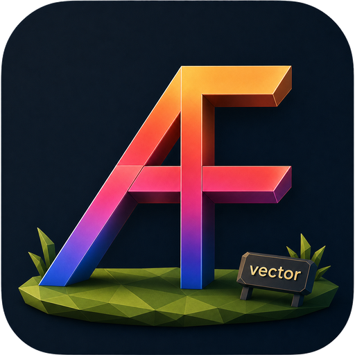

<div align="center">



# Gen2Vec ArtFont

矢量艺术字生成器

><div align="left">
>本地优先的 AI 艺术字工具：输入文字与风格描述，生成艺术字位图，并通过计算机视觉流水线转换为可编辑、可缩放的 SVG 矢量图。
></div>

[](#环境要求)
[](#技术栈)
[](#技术栈)

[特性](#特性) | [架构](#架构) | [快速开始](#快速开始) | [使用方式](#使用方式) | [构建](#构建)

</div>

---

## 特性

- **文生图生成**：对接 ComfyUI，支持 Flux Schnell、Z-Image Turbo、Qwen-Image 等工作流。
- **智能矢量化**：rembg 离线抠图、OpenCV 边缘保留降噪、颜色量化、vtracer SVG 路径追踪。
- **工作流降级**：按文本语言自动选择工作流；失败后切换候选工作流，最终兜底到 Pillow stub。
- **多端覆盖**：Electron + Vue 3 桌面端用于日常操作，Node.js CLI 用于批量任务和自动化验收。
- **批量处理**：支持 TXT / CSV / JSON 批量输入，逐条容错执行并生成汇总 CSV。
- **标准产物**：每次任务固定输出 `original.png`、`transparent.png`、`result.svg`、`preview.png`、`metadata.json`、`run.log`。
- **本地优先**：所有模型均使用本地模型，输入输出无需联网，生成的艺术字资产只写入本地。

---

## 架构

```text
┌───────────────────────────────────────────────┐
│                  Interface Layer              │
│  ┌──────────────────┐   ┌──────────────────┐  │
│  │ Electron + Vue 3 │   │ Node.js CLI      │  │
│  │   desktop GUI    │   │   automation     │  │
│  └────────┬─────────┘   └────────┬─────────┘  │
└───────────┼──────────────────────┼────────────┘
            │ HTTP / IPC           │ HTTP
            v                      v
┌───────────────────────────────────────────────┐
│                   Service Layer               │
│  ┌──────────────────┐   ┌──────────────────┐  │
│  │ txt2img-api      │   │ vectorizer-api   │  │
│  │ :9001            │   │ :8000            │  │
│  │ text -> bitmap   │   │ bitmap -> SVG    │  │
│  └────────┬─────────┘   └────────┬─────────┘  │
└───────────┼──────────────────────┼────────────┘
            │                      │
            v                      v
      ComfyUI :8188          rembg + OpenCV + vtracer
```

| 模块 | 路径 | 职责 |
|------|------|------|
| 桌面端 | [`apps/desktop`](apps/desktop/README.md) | UI、任务编排、历史恢复、打包后后端进程管理 |
| CLI | [`apps/cli`](apps/cli/README.md) | 命令行参数解析、后端调用、批量任务、产物写入 |
| 文生图服务 | [`services/txt2img-api`](services/txt2img-api/README.md) | ComfyUI 工作流加载、提示词注入、生成图片、降级策略 |
| 矢量化服务 | [`services/vectorizer-api`](services/vectorizer-api/README.md) | 图片来源解析、背景移除、预处理、SVG 生成、质量指标 |
| 测试集 | `tests/` | 验收测试脚本与夹具 |
| 文档 | `docs/` | 安装部署、算法原理、交付清单等 |

---

## 快速开始

### 环境要求

| 组件 | 要求 | 说明 |
|------|------|------|
| 操作系统 | Windows 10 / 11 | 当前打包流程按 Windows 设计 |
| Node.js | **20+** | 桌面端与 CLI；SEA 单文件构建需要 Node 20+ |
| Python | 3.13+ | 两个后端服务 |
| uv | 推荐 | Python 依赖管理（无 uv 时可用 pip） |
| GPU | NVIDIA 独显推荐 | ComfyUI 推理推荐独显；无 GPU 时可降级运行 |

### 补充依赖

ComfyUI 引擎、AI 模型和 rembg 模型可通过脚本一键补全：

```powershell
scripts\setup-deps.ps1
```

### 三步启动

```powershell
# 1. 启动矢量化后端（:8000）
cd services/vectorizer-api
uv sync
uv run vectorizer-api

# 2. 启动文生图后端（:9001）
cd services/txt2img-api
uv sync
uv run txt2img-api

# 3. 启动桌面端
cd apps/desktop
npm install
npm run electron:dev
```

开发模式下 Electron **不自动管理后端**，需保持两个后端终端运行。

### 验证服务

```powershell
node apps/cli/bin/gen2vec.mjs health
node apps/cli/bin/gen2vec.mjs env
```

预期两个服务均返回 **正常**。

> 详细安装步骤、环境变量和排错见 [`docs/安装部署说明.md`](docs/安装部署说明.md)。

---

## 使用方式

### 桌面端

提供单条生成、批量生成、图片矢量化三种模式，支持历史任务恢复与 SVG 预览。

> 详细说明见 [`apps/desktop/README.md`](apps/desktop/README.md)。

### CLI

```powershell
node apps/cli/bin/gen2vec.mjs pipeline --text "七里香" --prompt "清新国风，墨绿色金边"
```

支持 `pipeline`、`generate`、`vectorize`、`batch`、`health`、`env`、`shutdown` 等命令。

> 详细说明见 [`apps/cli/README.md`](apps/cli/README.md)。

---

## 构建

```powershell
# 后端 EXE
cd services/txt2img-api  && .\scripts\build-backend-exe.ps1
cd services/vectorizer-api && .\scripts\build-backend-exe.ps1

# CLI EXE（Node.js SEA，需 Node 20+）
cd apps/cli && npm install && npm run build

# Electron 安装包
cd apps/desktop && npm install && npm run electron:build
```

产物位于 `release/`，安装包会自动嵌入两个后端 EXE、CLI 和测试脚本。

> 各模块的打包细节与 `extraResources` 配置见对应子目录 README。

---

## 技术栈

| 层级 | 技术 |
|------|------|
| 桌面端 | Electron 42, Vue 3, Vite 8 |
| CLI | Node.js ES Modules, Node.js SEA |
| 后端框架 | FastAPI, Uvicorn, Pydantic |
| Python 依赖管理 | uv（`pyproject.toml` + `uv.lock`） |
| 文生图 | ComfyUI, Flux Schnell, Z-Image Turbo, Qwen-Image |
| 图像处理 | Pillow, OpenCV, scikit-image |
| 背景移除 | rembg, ONNX Runtime |
| 矢量化 | vtracer, svgwrite, cairosvg |
| 打包 | electron-builder, PyInstaller |

---

## 相关文档

| 文档 | 内容 |
|------|------|
| [`docs/用户使用说明.md`](docs/用户使用说明.md) | 桌面端操作流程、功能介绍 |
| [`docs/参数配置说明.md`](docs/参数配置说明.md) | 矢量化参数详解、环境变量列表 |
| [`docs/算法原理说明.md`](docs/算法原理说明.md) | 文生图与矢量化核心算法公式 |
| [`docs/模型与节点依赖清单.md`](docs/模型与节点依赖清单.md) | ComfyUI 模型与自定义节点清单 |
| [`docs/安装部署说明.md`](docs/安装部署说明.md) | 完整安装步骤与排错 |
| [`docs/交付清单.md`](docs/交付清单.md) | 项目交付物说明 |

---
